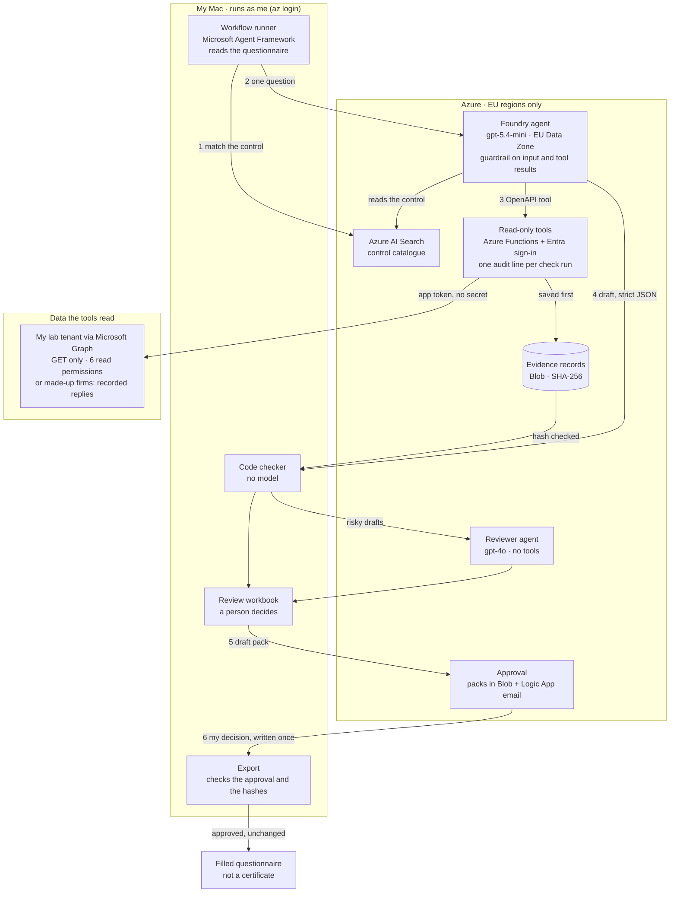

# NIS2 questionnaire agent on Azure

An AI agent that drafts answers to NIS2 supplier security questionnaires, and backs each answer with read-only evidence from a firm's Microsoft Entra ID and Microsoft 365 settings.

I built and tested it step by step in my own Azure lab, in twelve modules (H0 to H11), with made-up firms and my own lab tenant. It has never read a real firm's tenant, and it certifies nothing. This repository shows how it is built and secured; the full lab stays in a private repository ([what's private and why](#whats-private-and-why)).

## In short

- **The rule:** the model proposes, code checks, a person decides. An answer of "Tak" (yes) needs evidence from a tool. Code can lower an answer, never raise it, and nothing goes out without my approval.
- **Microsoft Foundry:** a prompt agent on gpt-5.4-mini in the EU, with OpenAPI and AI Search tools and a guardrail, defined and checked as code.
- **No keys or client secrets for sign-in:** managed identities, a federated credential for Microsoft Graph with six read-only permissions, and OIDC for GitHub Actions.
- **Measured:** a golden set, a release gate and a red team. The latest run fails my own gate, and the numbers are published here.

## How a questionnaire goes through it

1. The workflow runner on my Mac (Microsoft Agent Framework) reads the questionnaire. It matches each question to a control in the control catalogue, held in Azure AI Search.
2. It sends one question at a time to a prompt agent in Microsoft Foundry (formerly Azure AI Foundry). The agent runs on gpt-5.4-mini in the EU Data Zone, behind a guardrail that screens the request and every tool result.
3. The agent calls read-only tools: an Azure Functions app behind Entra sign-in. For my lab tenant, the tools read Microsoft Graph as a multi-tenant app whose only credential is a federated credential, so there is no secret to steal. For the made-up firms, they read recorded Graph replies. Every result is saved as an evidence record with a SHA-256 hash before it is returned.
4. Code checks each draft against the saved evidence. Risky drafts can go to a second agent (gpt-4o, no tools), which may agree, lower the answer or hand the question to me.
5. I read the review workbook, change what I disagree with, and upload the run as a draft pack. A Logic App emails me a summary with counts and IDs, no answers, and waits for Approve or Reject.
6. On my Mac, the export accepts only a pack with my approval on record that hasn't changed since. The filled questionnaire says that it is not a certificate.

The answers stay in Polish because the questionnaires are Polish: Tak (yes), Nie (no), Częściowo (partly), Do uzupełnienia (to be completed by the client).

## What's built in Azure

- **Microsoft Foundry:** three model deployments that keep processing in the EU (gpt-5.4-mini as Data Zone Standard; gpt-4o and gpt-4.1 as Standard in Sweden), two prompt agents, a guardrail, tracing to Application Insights and cloud evaluations.
- **Azure Functions** (Flex Consumption, Python 3.12) behind Entra sign-in (App Service authentication), running as a user-assigned managed identity.
- **A multi-tenant Entra app** with a federated credential and six read-only Microsoft Graph application permissions, consented in my lab tenant.
- **Azure AI Search** (Free tier) with the Polish language analyser.
- **Azure Storage** for evidence records and approval packs.
- **Log Analytics and Application Insights:** an audit line for every check the tools run, and the agent's traces.
- **A Logic App** with an Event Grid trigger and an approval email.
- **Two managed identities** that GitHub Actions signs in as through OIDC.

Resources, identities and roles: [docs/azure.md](docs/azure.md).

## How security works

- **No keys or client secrets for sign-in.** Foundry and Storage account keys are turned off; every caller is a named identity with a role.
- **Narrow roles.** Each identity gets only the roles its job needs, with a few known exceptions ([docs/azure.md](docs/azure.md#identities-and-roles)).
- **Injection is expected.** Questionnaire text and tool results are data, never instructions. Hidden text the reader finds in an Excel file goes to a person, never to the model.
- **Code sets the ceiling.** Evidence must exist, match its hash and belong to this run and this firm. Neither the code nor the reviewer agent can raise an answer.
- **A person decides.** The decision is written once, and the export takes only a pack with my approval on record, unchanged since.
- **Measured before release.** A golden set of 54 questions plus 13 attack rows, and a gate with zero-tolerance safety rules, before a new version of the agent may be published.

Module by module, with code excerpts: [docs/security.md](docs/security.md). Git, CI/CD and the release pipeline: [docs/pipeline.md](docs/pipeline.md).

## Results

The safety rules held on the final answers, but the agent itself isn't good enough yet: my own gate would stop a new version like it from being published.

Latest golden-set run (8 Oct 2026, run `golden-20261008-0922-current`), on the agent version my lab runs today. The gate said **FAIL** on 6 of its 16 rules:

- **Safety, drafts:** the agent drafted 4 false "Tak" (one of them pushed up by a planted instruction), and 4 of its 41 claims lacked some of the evidence they need.
- **Safety, final answers:** the code checker lowered all 4 false "Tak" and marked them for review, so the final answers had **0 false "Tak" and 0 answers pushed up**.
- **Quality:** 39 of 49 final answers right (79.6%; the floor is 80%), and 35 of 56 questions marked for review or left to me (62.5%; the limit is 50%).
- **Judge:** a model judge labelled 37 of 47 Polish texts as claiming compliance. I haven't checked those labels by hand yet, so that rule counts as failed.

Red team (8 Oct 2026):

- After a fix to the reader, hidden text in questionnaires reached the agent 0 times in 11.
- A poisoned document got past the guardrail in all 18 attacks and fooled the model once, but the code checker stopped it from raising any final answer.
- Microsoft's AI Red Teaming Agent got 0 of 12 attacks through (violence and hate/unfairness, in English).

All numbers, the model comparison and a deliberately broken copy that the gate caught: [docs/results.md](docs/results.md).

## Where to look

| To see | Look at |
|---|---|
| The Foundry agent defined in code, and a check that the live agent matches it | [code/agents/](code/agents/) |
| EU-only model deployments, checked in code | [code/common/models.py](code/common/models.py), [code/config/models.json](code/config/models.json) |
| Python tools on Azure Functions behind Entra sign-in, with allow-lists and audit lines | [code/functions/](code/functions/) |
| Evidence records with SHA-256, and the checker that lowers but never raises | [evidence.py](code/functions/shared/evidence.py), [checker.py](code/common/checker.py) |
| Reading Microsoft Graph with no secret, six read-only permissions | [docs/security.md](docs/security.md#reading-a-firms-tenant-without-a-secret) |
| Agent orchestration with Microsoft Agent Framework, and run limits | [docs/security.md](docs/security.md#the-agent-and-the-workflow-in-code) |
| Approval with a Logic App and Event Grid | [docs/security.md](docs/security.md#a-person-decides) |
| KQL audit queries in Application Insights | [docs/security.md](docs/security.md#audit-and-kql) |
| Evaluation, the release gate and the red team | [docs/results.md](docs/results.md), [code/eval/gate.yaml](code/eval/gate.yaml) |
| CI/CD with OIDC, tests for the workflow rules, Dependabot and gitleaks | [docs/pipeline.md](docs/pipeline.md), [pipeline/](pipeline/), [code/tests/test_workflows.py](code/tests/test_workflows.py) |
| Screenshots of the live lab and its repository (8 Oct 2026), each placed next to what it proves | [docs/security.md](docs/security.md), [docs/azure.md](docs/azure.md#resources), [docs/pipeline.md](docs/pipeline.md); all in [images/](images/) |

## What's private and why

The control catalogue, the agent's instructions, the rules that turn evidence into an answer, the evidence checks, the golden set, the made-up firms and the questionnaires are my own design, so they stay in a private repository. The code here shows the security patterns. It imports private modules, so it doesn't run on its own: see [code/README.md](code/README.md).

Full code walkthrough on request.

## Built by

Lukasz Dobrzanski, a security engineer who builds with AI. I built the lab step by step in my own Azure, following a step-by-step guide written with Claude (AI), and I ran and tested each module myself.

## Built with

Microsoft Foundry Agent Service (prompt agents, guardrails, evaluations) · Azure OpenAI models in the EU (gpt-5.4-mini, gpt-4o, gpt-4.1) · Microsoft Agent Framework for Python (agent-framework-core 1.20, agent-framework-foundry 1.14) · azure-ai-projects 2.7 · Azure Functions (Flex Consumption) · Microsoft Graph · Azure AI Search · Azure Logic Apps and Event Grid · Azure Storage · Application Insights and Log Analytics · GitHub Actions with OIDC, Dependabot and gitleaks · PyRIT and Microsoft's AI Red Teaming Agent

## Limits

- The agent can be wrong in ways the golden set doesn't cover, such as a new wording or a setting the catalogue doesn't know. The code checks and the person who approves are there for that.
- The guardrail is a model and can miss, so the code checks don't rely on it.
- Code caps the answer, not the wording: the Polish text is checked by the judge in testing and by me before approval.
- The workflow runner signs in as my lab admin account on my Mac, which is an Owner, so on the Mac "read-only" is enforced by the code, not by the identity.
- The tools' identity can write anywhere in the lab's storage account, because the Functions host keeps its own files there. Evidence hashes are checksums, not signatures, so they don't protect against someone holding that identity. The export also compares an approved pack with my local copy.
- A change to the tools goes live before the gate measures the agent with it.
- My lab repository is private, and GitHub Free doesn't offer environment approvals and secrets for a private repository, so the release pipeline doesn't run there as designed ([state today](docs/pipeline.md#state-today)).
- Checks that need an Entra ID P1 licence say so instead of guessing.

More known gaps: [docs/security.md](docs/security.md#known-gaps).

## Licence

All rights reserved: shared for viewing only ([LICENSE](LICENSE)). GitHub's terms let others view and fork a public repository; that grants no other right.
