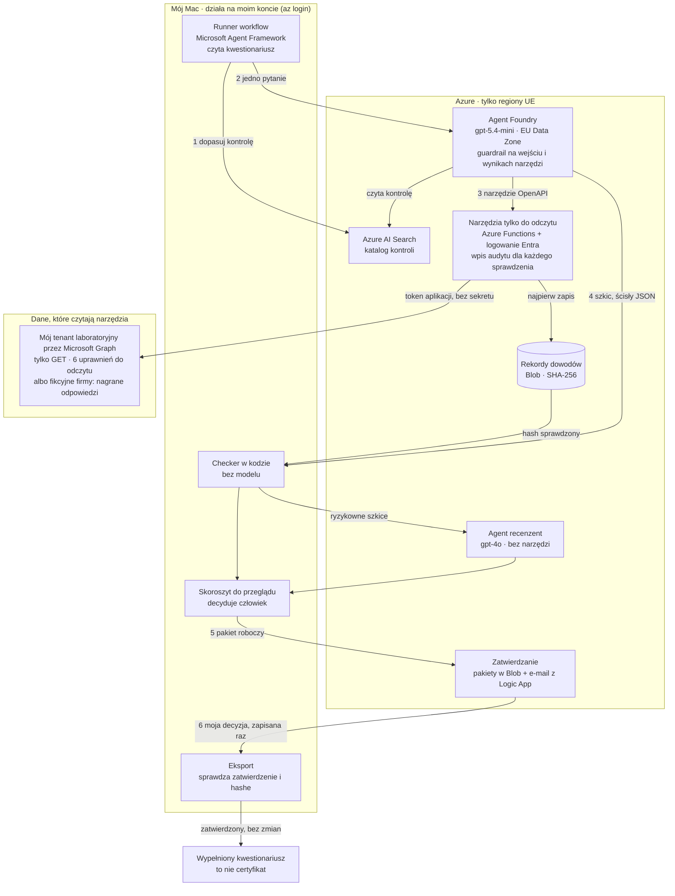

# Agent do kwestionariuszy NIS2 na Azure

[English](README.md) · **Polski**

Agent AI, który przygotowuje szkice odpowiedzi na kwestionariusze bezpieczeństwa NIS2 dla dostawców. Każdą odpowiedź opiera na dowodach z ustawień Microsoft Entra ID i Microsoft 365 firmy, zebranych w trybie tylko do odczytu.

Zbudowałem go i przetestowałem krok po kroku w moim własnym laboratorium Azure, w dwunastu modułach (H0–H11), na fikcyjnych firmach i na moim własnym tenancie laboratoryjnym. Nigdy nie odczytywał danych z tenanta prawdziwej firmy i niczego nie certyfikuje. To repozytorium pokazuje, jak jest zbudowany i zabezpieczony; całe laboratorium zostaje w prywatnym repozytorium ([co jest prywatne i dlaczego](#co-jest-prywatne-i-dlaczego)).

## W skrócie

- **Zasada:** model proponuje, kod sprawdza, człowiek decyduje. Odpowiedź „Tak” wymaga dowodu z narzędzia. Kod może obniżyć odpowiedź, ale nigdy jej nie podnosi, a nic nie wychodzi bez mojego zatwierdzenia.
- **Microsoft Foundry:** agent typu prompt na gpt-5.4-mini w UE, z narzędziami OpenAPI i AI Search oraz z guardrailem, zdefiniowany i sprawdzany jako kod.
- **Logowanie bez kluczy i sekretów klienta:** tożsamości zarządzane, poświadczenie federacyjne dla Microsoft Graph z sześcioma uprawnieniami tylko do odczytu oraz OIDC dla GitHub Actions.
- **Pomiary:** zestaw wzorcowy (golden set), bramka wydania i red team. Najnowszy przebieg nie przechodzi mojej własnej bramki, a wyniki są tu opublikowane.

## Jak kwestionariusz przechodzi przez system

1. Runner workflow na moim Macu (Microsoft Agent Framework) czyta kwestionariusz. Dopasowuje każde pytanie do kontroli z katalogu kontroli, który jest w Azure AI Search.
2. Wysyła pytania po jednym do agenta typu prompt w Microsoft Foundry (wcześniej Azure AI Foundry). Agent działa na gpt-5.4-mini w strefie danych UE (EU Data Zone), za guardrailem, który sprawdza zapytanie i każdy wynik narzędzia.
3. Agent wywołuje narzędzia tylko do odczytu: aplikację Azure Functions za logowaniem Entra. W moim tenancie laboratoryjnym narzędzia odczytują dane z Microsoft Graph jako aplikacja wielodostępna, której jedynym poświadczeniem jest poświadczenie federacyjne, więc nie ma sekretu do ukradzenia. W przypadku fikcyjnych firm czytają nagrane odpowiedzi Graph. Każdy wynik jest zapisywany jako rekord dowodu z hashem SHA-256, zanim zostanie zwrócony.
4. Kod sprawdza każdy szkic względem zapisanych dowodów. Ryzykowne szkice mogą trafić do drugiego agenta (gpt-4o, bez narzędzi), który może się zgodzić, obniżyć odpowiedź albo przekazać pytanie mnie.
5. Czytam skoroszyt do przeglądu, zmieniam to, z czym się nie zgadzam, i wysyłam przebieg jako pakiet roboczy. Logic App wysyła mi e-mailem podsumowanie z liczbami i identyfikatorami, bez treści odpowiedzi, i czeka na Approve albo Reject.
6. Na moim Macu eksport przyjmuje tylko pakiet z zapisanym moim zatwierdzeniem, niezmieniony od tamtej chwili. Wypełniony kwestionariusz zawiera zastrzeżenie, że nie jest certyfikatem.

Odpowiedź ma jedną z czterech wartości: Tak, Nie, Częściowo albo Do uzupełnienia (uzupełnia klient). Są po polsku, bo kwestionariusze są po polsku.

## Co jest zbudowane w Azure

- **Microsoft Foundry:** trzy wdrożenia modeli, które przetwarzają dane w UE (gpt-5.4-mini jako Data Zone Standard; gpt-4o i gpt-4.1 jako Standard w Szwecji), dwaj agenci typu prompt, guardrail, śledzenie (tracing) do Application Insights i ewaluacje w chmurze.
- **Azure Functions** (Flex Consumption, Python 3.12) za logowaniem Entra (uwierzytelnianie App Service), działające jako tożsamość zarządzana przypisana przez użytkownika.
- **Wielodostępna aplikacja Entra** z poświadczeniem federacyjnym i sześcioma uprawnieniami aplikacji Microsoft Graph tylko do odczytu, ze zgodą udzieloną w moim tenancie laboratoryjnym.
- **Azure AI Search** (warstwa Free) z polskim analizatorem językowym.
- **Azure Storage** na rekordy dowodów i pakiety do zatwierdzenia.
- **Log Analytics i Application Insights:** wpis audytu dla każdego sprawdzenia, które uruchomią narzędzia, oraz ślady (traces) agenta.
- **Logic App** z wyzwalaczem Event Grid i e-mailem do zatwierdzenia.
- **Dwie tożsamości zarządzane**, których GitHub Actions używa do logowania przez OIDC.

Zasoby, tożsamości i role: [docs/azure.pl.md](docs/azure.pl.md).

## Jak działa bezpieczeństwo

- **Logowanie bez kluczy i sekretów klienta.** Klucze kont Foundry i Storage są wyłączone; każdy, kto wywołuje usługę, to nazwana tożsamość z rolą.
- **Wąskie role.** Każda tożsamość ma tylko role potrzebne do jej zadania, z kilkoma znanymi wyjątkami ([docs/azure.pl.md](docs/azure.pl.md#tożsamości-i-role)).
- **Spodziewam się prompt injection.** Tekst kwestionariusza i wyniki narzędzi to dane, nigdy instrukcje. Ukryty tekst, który czytnik znajdzie w pliku Excel, trafia do człowieka, nigdy do modelu.
- **Kod wyznacza górną granicę.** Dowód musi istnieć, zgadzać się ze swoim hashem i należeć do tego przebiegu i tej firmy. Ani kod, ani agent recenzent nie mogą podnieść odpowiedzi.
- **Decyduje człowiek.** Decyzja jest zapisywana raz, a eksport przyjmuje tylko pakiet z zapisanym moim zatwierdzeniem, niezmieniony od tamtej chwili.
- **Pomiar przed wydaniem.** Zestaw wzorcowy 54 pytań plus 13 wierszy ataku oraz bramka z zasadami bezpieczeństwa o zerowej tolerancji, zanim nowa wersja agenta może zostać opublikowana.

Moduł po module, z fragmentami kodu: [docs/security-design.pl.md](docs/security-design.pl.md). Git, CI/CD i pipeline wydania: [docs/pipeline.pl.md](docs/pipeline.pl.md).

## Wyniki

W odpowiedziach końcowych zasady bezpieczeństwa zadziałały, ale sam agent nie jest jeszcze wystarczająco dobry: moja własna bramka nie pozwoliłaby opublikować nowej wersji takiej jak ta.

Najnowszy przebieg na zestawie wzorcowym (8 października 2026, przebieg `golden-20261008-0922-current`), na wersji agenta, której moje laboratorium używa dziś. Bramka zwróciła **FAIL** dla 6 z 16 zasad:

- **Bezpieczeństwo, szkice:** agent napisał 4 fałszywe „Tak” (jedno z nich podbite przez podrzuconą instrukcję), a 4 z jego 41 twierdzeń nie miały części potrzebnych dowodów.
- **Bezpieczeństwo, odpowiedzi końcowe:** checker w kodzie obniżył wszystkie 4 fałszywe „Tak” i oznaczył je do przeglądu, więc odpowiedzi końcowe miały **0 fałszywych „Tak” i 0 podbitych odpowiedzi**.
- **Jakość:** 39 z 49 odpowiedzi końcowych poprawnych (79,6%; próg to 80%) oraz 35 z 56 pytań oznaczonych do przeglądu lub pozostawionych do mojej decyzji (62,5%; limit to 50%).
- **Sędzia:** model-sędzia oznaczył 37 z 47 polskich tekstów jako deklarujące zgodność. Nie sprawdziłem jeszcze tych etykiet ręcznie, więc ta zasada liczy się jako niespełniona.

Red team (8 października 2026):

- Po poprawce czytnika ukryty tekst w kwestionariuszach dotarł do agenta 0 razy na 11.
- Zatruty dokument przeszedł przez guardrail we wszystkich 18 atakach i raz oszukał model, ale checker w kodzie nie pozwolił mu podnieść żadnej odpowiedzi końcowej.
- AI Red Teaming Agent Microsoftu: 0 z 12 ataków się powiodło (przemoc oraz nienawiść/niesprawiedliwość, po angielsku).

Wszystkie liczby, porównanie modeli i celowo zepsuta kopia, którą wyłapała bramka: [docs/results.pl.md](docs/results.pl.md).

## Gdzie szukać

| Co zobaczyć | Gdzie |
|---|---|
| Agent Foundry zdefiniowany w kodzie i sprawdzenie, czy działający agent się z nim zgadza | [code/agents/](code/agents/) |
| Wdrożenia modeli tylko w UE, sprawdzane w kodzie | [code/common/models.py](code/common/models.py), [code/config/models.json](code/config/models.json) |
| Narzędzia w Pythonie na Azure Functions za logowaniem Entra, z allow-listami i wpisami audytu | [code/functions/](code/functions/) |
| Rekordy dowodów z SHA-256 i checker, który obniża, ale nigdy nie podnosi | [evidence.py](code/functions/shared/evidence.py), [checker.py](code/common/checker.py) |
| Odczyt Microsoft Graph bez sekretu, sześć uprawnień tylko do odczytu | [docs/security-design.pl.md](docs/security-design.pl.md#odczyt-tenanta-firmy-bez-sekretu) |
| Orkiestracja agenta w Microsoft Agent Framework i limity przebiegu | [docs/security-design.pl.md](docs/security-design.pl.md#agent-i-workflow-w-kodzie) |
| Zatwierdzanie przez Logic App i Event Grid | [docs/security-design.pl.md](docs/security-design.pl.md#decyduje-człowiek) |
| Zapytania KQL do audytu w Application Insights | [docs/security-design.pl.md](docs/security-design.pl.md#audyt-i-kql) |
| Ewaluacja, bramka wydania i red team | [docs/results.pl.md](docs/results.pl.md), [code/eval/gate.yaml](code/eval/gate.yaml) |
| CI/CD z OIDC, testy zasad workflow, Dependabot i gitleaks | [docs/pipeline.pl.md](docs/pipeline.pl.md), [pipeline/](pipeline/), [code/tests/test_workflows.py](code/tests/test_workflows.py) |
| Zrzuty ekranu działającego laboratorium i jego repozytorium (8 października 2026), każdy obok tego, czego dowodzi | [docs/security-design.pl.md](docs/security-design.pl.md), [docs/azure.pl.md](docs/azure.pl.md#zasoby), [docs/pipeline.pl.md](docs/pipeline.pl.md); wszystkie w [images/](images/) |

## Co jest prywatne i dlaczego

Katalog kontroli, instrukcje agenta, zasady, które zamieniają dowody w odpowiedź, sprawdzenia dowodów, zestaw wzorcowy, fikcyjne firmy i kwestionariusze to moje własne opracowanie, więc zostają w prywatnym repozytorium. Kod w tym repozytorium pokazuje wzorce bezpieczeństwa. Importuje prywatne moduły, więc sam nie działa: zobacz [code/README.pl.md](code/README.pl.md).

Pełne omówienie kodu na prośbę.

## Autor

Lukasz Dobrzanski, inżynier bezpieczeństwa, który tworzy rozwiązania z wykorzystaniem AI. Zbudowałem to laboratorium krok po kroku w moim własnym Azure, według przewodnika krok po kroku napisanego przy użyciu Claude (AI), a każdy moduł sam uruchomiłem i przetestowałem.

## Technologie

Microsoft Foundry Agent Service (agenci typu prompt, guardraile, ewaluacje) · modele Azure OpenAI w UE (gpt-5.4-mini, gpt-4o, gpt-4.1) · Microsoft Agent Framework dla Pythona (agent-framework-core 1.20, agent-framework-foundry 1.14) · azure-ai-projects 2.7 · Azure Functions (Flex Consumption) · Microsoft Graph · Azure AI Search · Azure Logic Apps i Event Grid · Azure Storage · Application Insights i Log Analytics · GitHub Actions z OIDC, Dependabot i gitleaks · PyRIT i AI Red Teaming Agent Microsoftu

## Ograniczenia

- Agent może się mylić w sposób, którego zestaw wzorcowy nie obejmuje, np. przy nowym sformułowaniu albo ustawieniu, którego katalog nie zna. Dlatego są sprawdzenia w kodzie i człowiek, który zatwierdza.
- Guardrail to model i może coś przeoczyć, więc sprawdzenia w kodzie na nim nie polegają.
- Kod ogranicza odpowiedź, nie sformułowanie: polski tekst sprawdza sędzia w testach, a ja przed zatwierdzeniem.
- Runner workflow loguje się na moim Macu moim kontem admina laboratorium, które ma rolę Owner, więc na Macu „tylko do odczytu” zapewnia kod, a nie tożsamość.
- Tożsamość narzędzi może zapisywać w całym koncie magazynu laboratorium, bo host Functions trzyma tam swoje pliki. Hashe dowodów to sumy kontrolne, nie podpisy, więc nie chronią przed kimś, kto ma tę tożsamość. Eksport porównuje też zatwierdzony pakiet z moją lokalną kopią.
- Zmiana w narzędziach zaczyna działać, zanim bramka zmierzy z nią agenta.
- Moje repozytorium laboratorium jest prywatne, a GitHub Free nie daje zatwierdzeń ani sekretów środowisk w prywatnych repozytoriach, więc pipeline wydania nie działa tam tak, jak go zaprojektowałem ([stan obecny](docs/pipeline.pl.md#stan-obecny)).
- Sprawdzenia, które wymagają licencji Entra ID P1, zgłaszają to, zamiast zgadywać.

Więcej znanych luk: [docs/security-design.pl.md](docs/security-design.pl.md#znane-luki).

## Licencja

Wszelkie prawa zastrzeżone: udostępnione tylko do wglądu ([LICENSE](LICENSE), po angielsku). Regulamin GitHuba pozwala innym oglądać i forkować publiczne repozytorium; nie daje to żadnych innych praw.
