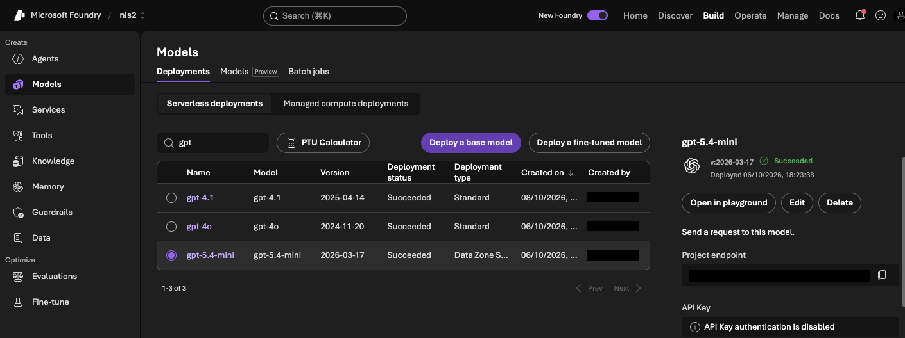
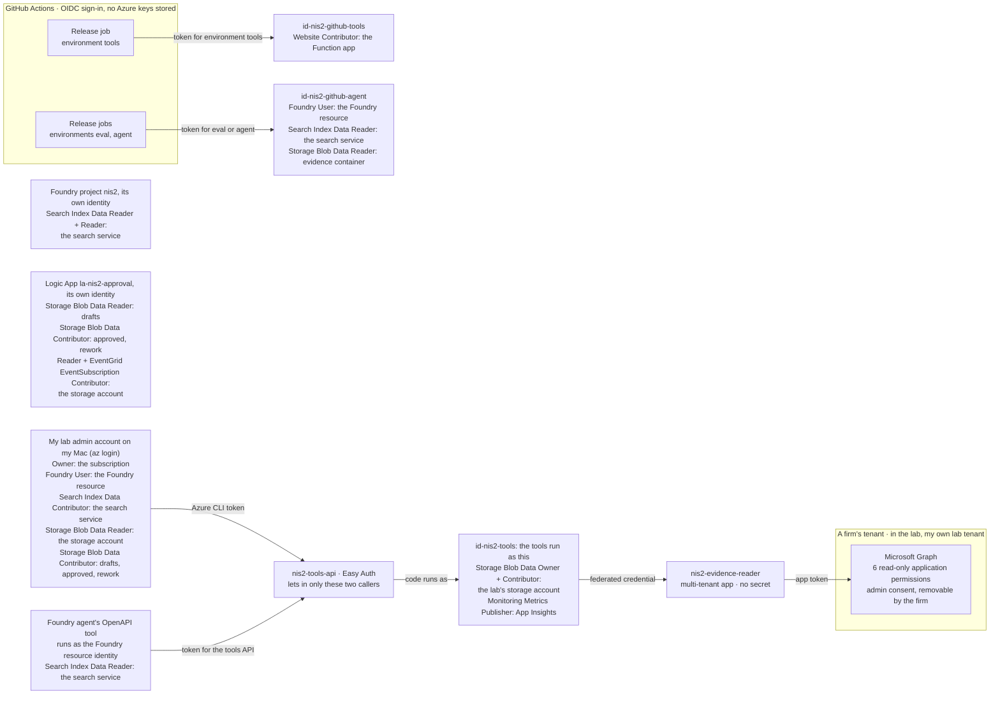

# Azure resources and identities

What the lab runs in Azure (H0 to H11), where, and who may do what. The names are the lab's own, except for resources whose names must be unique across Azure: those are described instead of named. No IDs appear anywhere in this repository.

**Contents**

1. [Resources](#resources)
2. [Identities and roles](#identities-and-roles)
3. [What a stolen identity could do](#what-a-stolen-identity-could-do)
4. [Cost fences](#cost-fences)

## Resources

| Resource | Type | Region | What it's for |
|---|---|---|---|
| `rg-nis2-lab` | Resource group with a monthly budget | Sweden Central | Holds the whole lab, so its cost shows in one place |
| The Foundry resource, and its project `nis2` | Microsoft Foundry resource and project, API keys off | Sweden Central | Model deployments, the two agents, the guardrail, evaluations |
| `gpt-5.4-mini` | Model deployment, Data Zone Standard | EU data zone | Drafts the answers; picks a control when the search isn't sure |
| `gpt-4o` | Model deployment, Standard | Sweden | The reviewer agent; the rival drafter in the model comparison |
| `gpt-4.1` | Model deployment, Standard | Sweden | Judges only the Polish wording in evaluations |
| `kwestionariusz-nis2`, `recenzent-nis2` | Foundry prompt agents | in the project | The drafter (two tools) and the reviewer (no tools) |
| `nis2-guardrail` | Foundry guardrail | in the resource | Prompt attacks in user input, indirect attacks in tool responses |
| `nis2-controls` | Index in an Azure AI Search service, Free tier | an EU region | The control catalogue: keyword search with the Polish analyser |
| The lab's storage account | Storage account, Standard, locally redundant, account keys off, no anonymous access | Sweden Central | Evidence records (`evidence`); packs (`drafts`, `approved`, `rework`); the Functions host's own files |
| The Function app | Flex Consumption, Python 3.12, at most 10 instances | Sweden Central | The read-only tools |
| `id-nis2-tools` | User-assigned managed identity | Sweden Central | What the tools run as |
| `nis2-tools-api` | Entra app registration (Easy Auth) | Entra ID | Stands for the tools' API: which apps and identities may call it |
| `nis2-evidence-reader` | Entra multi-tenant app registration | Entra ID | Read-only Microsoft Graph access in a firm's tenant |
| `log-nis2`, `appi-nis2` | Log Analytics workspace, Application Insights | Sweden Central | Audit lines and agent traces |
| `egst-nis2-storage` | Event Grid system topic | with the storage account | Tells the Logic App that a pack landed in `drafts` |
| `la-nis2-approval` | Logic App (Consumption) with its own managed identity | Sweden Central | The approval email and the decision |
| `id-nis2-github-tools`, `id-nis2-github-agent` | User-assigned managed identities | Sweden Central | What GitHub Actions release jobs sign in as, through OIDC |

Where data is processed: each model deployment's type decides it. `config/models.json` records the plan, checked against Microsoft's pages on 6 Oct 2026: Data Zone Standard processes only inside the EU data zone, and Standard only in the resource's own geography (Sweden). [models.py](../code/common/models.py) flags any other type, because a Global deployment may process data anywhere in the world.

*The three GPT deployments in my Foundry project, filtered on "gpt", 8 Oct 2026: gpt-5.4-mini as Data Zone Standard ("Data Zone S…" in the list), gpt-4o and gpt-4.1 as Standard, each on a fixed version. On the right: API key sign-in is disabled. Covered: the endpoint and the account that created them.*

`config/models.json` also lists two optional GPT-6 models for a later comparison; none of the runs in [results.md](results.md) used them.

The tools, Foundry and the storage account are reachable from the internet, with Entra sign-in and roles as the only door. Private networking was out of scope for this lab ([known gaps](security-design.md#known-gaps)).

## Identities and roles

The role assignments as they are in the lab, read with Azure CLI on 8 Oct 2026:

| Identity | What it is | Roles, and where |
|---|---|---|
| My lab admin account | The account I sign in with. The workflow on my Mac runs as it (`az login`). | Owner on the subscription. Data roles: Foundry User on the Foundry resource; Search Index Data Contributor on the search service; Storage Blob Data Reader on the whole storage account; Storage Blob Data Contributor on `drafts`, `approved` and `rework` |
| The Foundry resource's identity | System-assigned. The agent's OpenAPI tool signs in to my tools as it. | Search Index Data Reader on the search service. Easy Auth lets it call the tools. |
| The Foundry project's identity | System-assigned, for the project `nis2` | Search Index Data Reader and Reader on the search service |
| `id-nis2-tools` | User-assigned. The Function app runs as it. | Storage Blob Data Owner and Storage Blob Data Contributor on the lab's storage account; Monitoring Metrics Publisher on Application Insights. `nis2-evidence-reader` trusts it through a federated credential. |
| `nis2-evidence-reader` | The multi-tenant app a firm's admin consents to. No secret, no certificate. | Six read-only Microsoft Graph application permissions, consented in my lab tenant |
| `nis2-tools-api` | The app registration Easy Auth uses for the tools' API. It still holds the client secret Easy Auth created for browser sign-in and the default User.Read permission; the tools use neither. | None. Its settings let in two client apps and two identities. |
| `la-nis2-approval` | The Logic App's system-assigned identity | Storage Blob Data Reader on `drafts`; Storage Blob Data Contributor on `approved` and `rework`; Reader and EventGrid EventSubscription Contributor on the storage account |
| `id-nis2-github-tools` | User-assigned. GitHub's `tools` job signs in as it. | Website Contributor on the Function app |
| `id-nis2-github-agent` | User-assigned. GitHub's `gate` and `agent` jobs sign in as it. | Foundry User on the Foundry resource; Search Index Data Reader on the search service; Storage Blob Data Reader on `evidence` |

Why the narrow ones are narrow:

- The two Foundry identities, the resource's and the project's, get only read roles on the search service, not contributor roles: the agent only needs to search.
- The Logic App can read packs but never change them, and it can write only to `approved` and `rework`.
- The deploying GitHub identity can't touch Foundry or the evidence, and the measuring one can't deploy code or write to storage. The `gate` and `agent` jobs share the measuring identity, so the `gate` job could also create an agent version (below).

The known exceptions:

- My admin account is an Owner, and its storage roles are wider than the design. It can read the whole storage account, not only `evidence`, `approved` and `rework`, and it can write to `approved` and `rework`, not only `drafts`.
- The tools' identity can write anywhere in the lab's storage account.
- The `gate` job's identity could create an agent version.

More in the [README's Limits](../README.md#limits) and the [known gaps](security-design.md#known-gaps).

## What a stolen identity could do

**`id-nis2-tools`, or the Function app.** Whoever controls it can sign in as `nis2-evidence-reader` in every tenant that consented to it. They could read what the six permissions allow: security settings, who holds admin roles, the apps and their permissions, app secret names and expiry dates (never the secrets themselves), licences and recent directory changes. They couldn't read mail, files or chats, and couldn't change anything in the tenant. In the lab's storage account they could change files, which is why the export also compares an approved pack with my local copy.

**`id-nis2-github-tools`.** Website Contributor on the Function app can change the app's settings and Easy Auth, and the code it deploys runs as `id-nis2-tools`. So I treat it as holding the tools' rights too: as designed, only the approved `tools` job on `main` can sign in as it ([state today](pipeline.md#state-today)), that job installs no Python packages, and every deploy ends with a check that the tools still refuse a caller without a token ([pipeline.md](pipeline.md#the-release)).

**`id-nis2-github-agent`.** The `gate` job installs dozens of Python packages, so a poisoned package would run with this identity's rights. It can't deploy code or write to storage. But Foundry User is the role for building and testing agents, so a poisoned package could create a new version of the agent, whatever the workflow says. What lowers that risk: every package is pinned to an exact version, Dependabot offers a new version only once it's a week old, and running [check_agent.py](../code/agents/check_agent.py) shows whether the live agent differs from the code.

## Cost fences

- A €25 monthly budget on `rg-nis2-lab`, with alerts at 50%, 80% and 100% of actual spend and at 100% of forecast. A budget warns; it doesn't stop anything.
- A 0.5 GB daily cap on Log Analytics.
- The Function app may run at most 10 instances at once, with none kept warm.
- A speed limit (tokens per minute) on each model deployment, as planned in [models.json](../code/config/models.json), which slows a runaway loop down.
- Hard limits in each workflow run: at most 40 questions, 200 tool calls and €2 ([security-design.md](security-design.md#the-agent-and-the-workflow-in-code)).
- A gate rule: drafting and matching a 30-question questionnaire must cost €1.00 or less ([gate.yaml](../code/eval/gate.yaml)).
