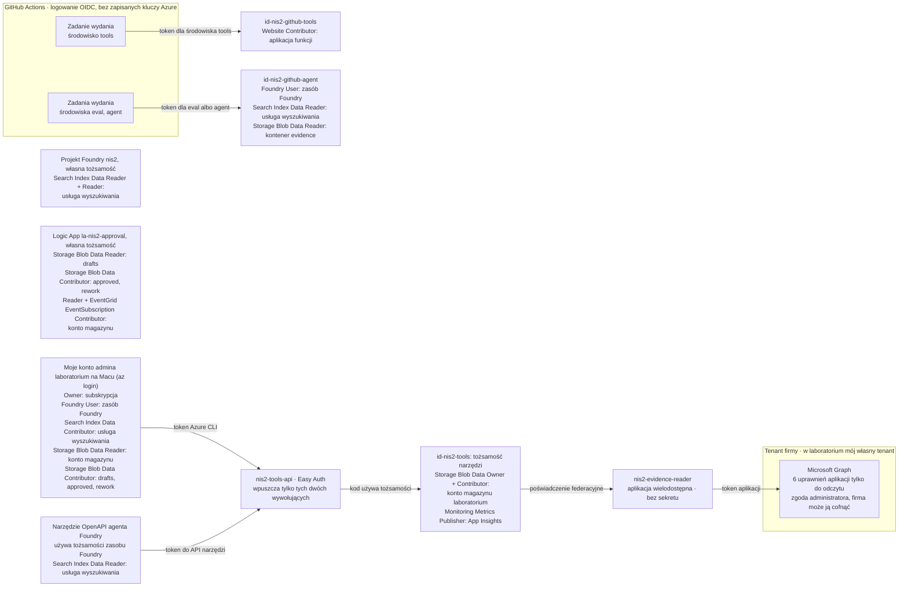

# Zasoby i tożsamości w Azure

[English](azure.md) · **Polski**

Co laboratorium uruchamia w Azure (H0–H11), gdzie i kto może co robić. Nazwy są takie jak w laboratorium, z wyjątkiem zasobów, których nazwy muszą być unikalne w całym Azure: zamiast ich nazw podaję opis. W tym repozytorium nie ma żadnych identyfikatorów (ID).

**Spis treści**

1. [Zasoby](#zasoby)
2. [Tożsamości i role](#tożsamości-i-role)
3. [Co może zrobić skradziona tożsamość](#co-może-zrobić-skradziona-tożsamość)
4. [Limity kosztów](#limity-kosztów)

## Zasoby

| Zasób | Typ | Region | Do czego służy |
|---|---|---|---|
| `rg-nis2-lab` | Grupa zasobów z miesięcznym budżetem | Sweden Central | Trzyma całe laboratorium, więc jego koszt widać w jednym miejscu |
| Zasób Foundry i jego projekt `nis2` | Zasób i projekt Microsoft Foundry, klucze API wyłączone | Sweden Central | Wdrożenia modeli, dwaj agenci, guardrail, ewaluacje |
| `gpt-5.4-mini` | Wdrożenie modelu, Data Zone Standard | Strefa danych UE | Pisze szkice odpowiedzi; wybiera kontrolę, gdy wyszukiwanie nie jest pewne |
| `gpt-4o` | Wdrożenie modelu, Standard | Szwecja | Agent recenzent; konkurencyjny autor szkiców w porównaniu modeli |
| `gpt-4.1` | Wdrożenie modelu, Standard | Szwecja | W ewaluacjach ocenia tylko polskie sformułowania |
| `kwestionariusz-nis2`, `recenzent-nis2` | Agenci typu prompt w Foundry | w projekcie | Autor szkiców (dwa narzędzia) i recenzent (bez narzędzi) |
| `nis2-guardrail` | Guardrail Foundry | w zasobie | Ataki na prompt w danych od użytkownika, ataki pośrednie w odpowiedziach narzędzi |
| `nis2-controls` | Indeks w usłudze Azure AI Search, warstwa Free | region w UE | Katalog kontroli: wyszukiwanie słów kluczowych z polskim analizatorem |
| Konto magazynu laboratorium | Konto magazynu Standard, lokalnie nadmiarowe, klucze konta wyłączone, bez dostępu anonimowego | Sweden Central | Rekordy dowodów (`evidence`); pakiety (`drafts`, `approved`, `rework`); własne pliki hosta Functions |
| Aplikacja funkcji | Flex Consumption, Python 3.12, najwyżej 10 instancji | Sweden Central | Narzędzia tylko do odczytu |
| `id-nis2-tools` | Tożsamość zarządzana przypisana przez użytkownika | Sweden Central | Tożsamość używana przez narzędzia |
| `nis2-tools-api` | Rejestracja aplikacji Entra (Easy Auth) | Entra ID | Reprezentuje API narzędzi: które aplikacje i tożsamości mogą je wywołać |
| `nis2-evidence-reader` | Wielodostępna rejestracja aplikacji Entra | Entra ID | Dostęp tylko do odczytu do Microsoft Graph w tenancie firmy |
| `log-nis2`, `appi-nis2` | Obszar roboczy Log Analytics, Application Insights | Sweden Central | Wpisy audytu i ślady agenta |
| `egst-nis2-storage` | Temat systemowy Event Grid | przy koncie magazynu | Informuje Logic App, że pakiet trafił do `drafts` |
| `la-nis2-approval` | Logic App (Consumption) z własną tożsamością zarządzaną | Sweden Central | E-mail do zatwierdzenia i decyzja |
| `id-nis2-github-tools`, `id-nis2-github-agent` | Tożsamości zarządzane przypisane przez użytkownika | Sweden Central | Tożsamości, których zadania wydania w GitHub Actions używają do logowania przez OIDC |

Gdzie przetwarzane są dane: decyduje o tym typ każdego wdrożenia modelu. `config/models.json` zapisuje plan, sprawdzony ze stronami Microsoftu 6 października 2026: Data Zone Standard przetwarza dane tylko w strefie danych UE, a Standard tylko w geografii samego zasobu (Szwecja). [models.py](../code/common/models.py) zgłasza każdy inny typ, bo wdrożenie Global może przetwarzać dane w dowolnym miejscu na świecie.

*Trzy wdrożenia GPT w moim projekcie Foundry, przefiltrowane po „gpt”, 8 października 2026: gpt-5.4-mini jako Data Zone Standard („Data Zone S…” na liście), gpt-4o i gpt-4.1 jako Standard, każde na stałej wersji. Po prawej: logowanie kluczem API jest wyłączone. Zakryte: endpoint i konto, które je utworzyło.*

`config/models.json` wymienia też dwa opcjonalne modele GPT-6 do późniejszego porównania; żaden z przebiegów w [results.pl.md](results.pl.md) ich nie używał.

Narzędzia, Foundry i konto magazynu są osiągalne z internetu, a jedynymi drzwiami są logowanie Entra i role. Sieć prywatna była poza zakresem tego laboratorium ([znane luki](security-design.pl.md#znane-luki)).

## Tożsamości i role

Przypisania ról w obecnym stanie laboratorium, odczytane przez Azure CLI 8 października 2026:

| Tożsamość | Czym jest | Role i gdzie |
|---|---|---|
| Moje konto admina laboratorium | Konto, którym się loguję. Workflow na moim Macu działa na tym koncie (`az login`). | Owner na subskrypcji. Role danych: Foundry User na zasobie Foundry; Search Index Data Contributor na usłudze wyszukiwania; Storage Blob Data Reader na całym koncie magazynu; Storage Blob Data Contributor na `drafts`, `approved` i `rework` |
| Tożsamość zasobu Foundry | Przypisana przez system. Narzędzie OpenAPI agenta loguje się tą tożsamością do moich narzędzi. | Search Index Data Reader na usłudze wyszukiwania. Easy Auth pozwala jej wywoływać narzędzia. |
| Tożsamość projektu Foundry | Przypisana przez system, dla projektu `nis2` | Search Index Data Reader i Reader na usłudze wyszukiwania |
| `id-nis2-tools` | Przypisana przez użytkownika. Aplikacja funkcji używa tej tożsamości. | Storage Blob Data Owner i Storage Blob Data Contributor na koncie magazynu laboratorium; Monitoring Metrics Publisher na Application Insights. `nis2-evidence-reader` ufa jej przez poświadczenie federacyjne. |
| `nis2-evidence-reader` | Aplikacja wielodostępna, na którą zgodę wyraża administrator firmy. Bez sekretu i bez certyfikatu. | Sześć uprawnień aplikacji Microsoft Graph tylko do odczytu, ze zgodą udzieloną w moim tenancie laboratoryjnym |
| `nis2-tools-api` | Rejestracja aplikacji, której Easy Auth używa dla API narzędzi. Nadal ma sekret klienta, który Easy Auth utworzył do logowania przez przeglądarkę, i domyślne uprawnienie User.Read; narzędzia nie używają żadnego z nich. | Brak. Jej ustawienia wpuszczają dwie aplikacje klienckie i dwie tożsamości. |
| `la-nis2-approval` | Tożsamość Logic App przypisana przez system | Storage Blob Data Reader na `drafts`; Storage Blob Data Contributor na `approved` i `rework`; Reader i EventGrid EventSubscription Contributor na koncie magazynu |
| `id-nis2-github-tools` | Przypisana przez użytkownika. Zadanie `tools` w GitHubie loguje się tą tożsamością. | Website Contributor na aplikacji funkcji |
| `id-nis2-github-agent` | Przypisana przez użytkownika. Zadania `gate` i `agent` w GitHubie logują się tą tożsamością. | Foundry User na zasobie Foundry; Search Index Data Reader na usłudze wyszukiwania; Storage Blob Data Reader na `evidence` |

Dlaczego te role są wąskie:

- Dwie tożsamości Foundry, zasobu i projektu, mają na usłudze wyszukiwania tylko role do odczytu, a nie role Contributor: agent musi tylko wyszukiwać.
- Logic App może czytać pakiety, ale nie może ich zmieniać, a zapisywać może tylko w `approved` i `rework`.
- Tożsamość GitHuba, która wdraża, nie ma dostępu do Foundry ani do dowodów, a ta, która mierzy, nie może wdrażać kodu ani zapisywać w magazynie. Zadania `gate` i `agent` współdzielą tożsamość mierzącą, więc zadanie `gate` mogłoby też utworzyć wersję agenta (niżej).

Znane wyjątki:

- Moje konto admina ma rolę Owner, a jego role w magazynie są szersze, niż zakłada projekt rozwiązania. Może czytać całe konto magazynu, nie tylko `evidence`, `approved` i `rework`, i może zapisywać w `approved` i `rework`, nie tylko w `drafts`.
- Tożsamość narzędzi może zapisywać w całym koncie magazynu laboratorium.
- Tożsamość zadania `gate` mogłaby utworzyć wersję agenta.

Więcej w [Ograniczeniach w README](../README.pl.md#ograniczenia) i w [znanych lukach](security-design.pl.md#znane-luki).

## Co może zrobić skradziona tożsamość

**`id-nis2-tools` albo aplikacja funkcji.** Kto ją kontroluje, może zalogować się jako `nis2-evidence-reader` w każdym tenancie, który wyraził zgodę na tę aplikację. Mógłby czytać to, na co pozwala sześć uprawnień: ustawienia bezpieczeństwa, kto ma role administratora, aplikacje i ich uprawnienia, nazwy i daty wygaśnięcia sekretów aplikacji (nigdy samych sekretów), licencje i ostatnie zmiany w katalogu. Nie mógłby czytać poczty, plików ani czatów i nie mógłby niczego zmienić w tenancie. W koncie magazynu laboratorium mógłby zmieniać pliki, dlatego eksport porównuje też zatwierdzony pakiet z moją lokalną kopią.

**`id-nis2-github-tools`.** Rola Website Contributor na aplikacji funkcji pozwala zmieniać ustawienia aplikacji i Easy Auth, a kod, który ta tożsamość wdraża, działa jako `id-nis2-tools`. Dlatego traktuję ją tak, jakby miała też uprawnienia narzędzi: z założenia logować się nią może tylko zatwierdzone zadanie `tools` na `main` ([stan obecny](pipeline.pl.md#stan-obecny)), to zadanie nie instaluje pakietów Pythona, a każde wdrożenie kończy się sprawdzeniem, że narzędzia nadal odrzucają wywołanie bez tokena ([pipeline.pl.md](pipeline.pl.md#wydanie)).

**`id-nis2-github-agent`.** Zadanie `gate` instaluje dziesiątki pakietów Pythona, więc zatruty pakiet działałby z uprawnieniami tej tożsamości. Nie może ona wdrażać kodu ani zapisywać w magazynie. Ale Foundry User to rola do budowania i testowania agentów, więc zatruty pakiet mógłby utworzyć nową wersję agenta, niezależnie od tego, co przewiduje workflow. Co zmniejsza to ryzyko: każdy pakiet jest przypięty do dokładnej wersji, Dependabot proponuje nową wersję dopiero, gdy ma ona tydzień, a uruchomienie [check_agent.py](../code/agents/check_agent.py) pokazuje, czy działający agent różni się od kodu.

## Limity kosztów

- Miesięczny budżet 25 € na `rg-nis2-lab`, z alertami przy 50%, 80% i 100% faktycznych wydatków oraz przy 100% prognozy. Budżet ostrzega; niczego nie zatrzymuje.
- Dzienny limit 0,5 GB w Log Analytics.
- Aplikacja funkcji może działać na najwyżej 10 instancjach naraz, bez żadnej utrzymywanej w gotowości.
- Limit szybkości (tokeny na minutę) na każdym wdrożeniu modelu, zgodnie z planem w [models.json](../code/config/models.json); taki limit spowalnia pętlę, która wymknęła się spod kontroli.
- Twarde limity w każdym przebiegu workflow: najwyżej 40 pytań, 200 wywołań narzędzi i 2 € ([security-design.pl.md](security-design.pl.md#agent-i-workflow-w-kodzie)).
- Zasada bramki: szkic i dopasowanie kwestionariusza z 30 pytaniami muszą kosztować najwyżej 1,00 € ([gate.yaml](../code/eval/gate.yaml)).
