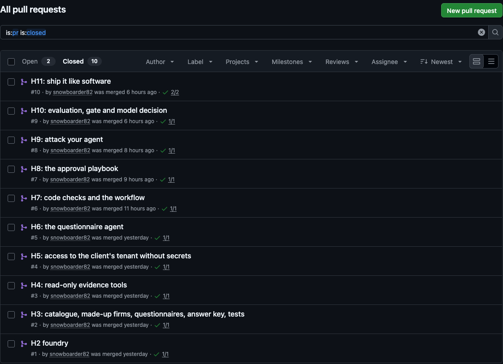
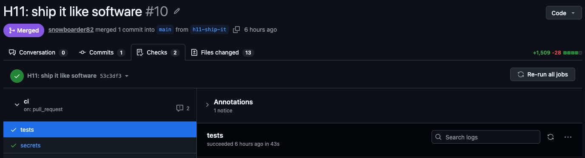
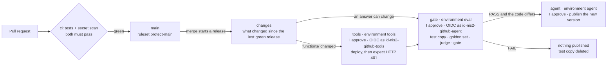
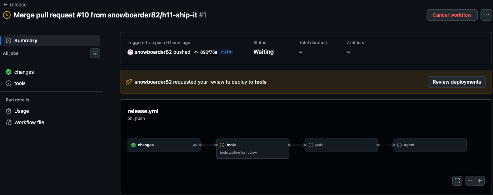

# Git, CI/CD and the release pipeline

How a change gets from my Mac to Azure, as I designed and built it in modules H1 and H11. Its state today is at the [end](#state-today). The four pipeline files are in [`pipeline/`](../pipeline/), copied unchanged from commit `892f75a`. In my lab they live in `.github/` and `.githooks/`; here they sit outside `.github/`, so GitHub never runs them.

**Contents**

1. [How a change is made](#how-a-change-is-made)
2. [Checks before a merge](#checks-before-a-merge)
3. [The release](#the-release)
4. [Settings without keys](#settings-without-keys)
5. [Supply chain](#supply-chain)
6. [Tests for the pipeline itself](#tests-for-the-pipeline-itself)
7. [State today](#state-today)

## How a change is made

- Every change reached `main` through a pull request from its own branch: #1 to #10, one per module from H2 to H11 (the first one also carried H1's work).
- Commits use GitHub's no-reply address, so my email address isn't in the history.
- On my Mac, a commit hook ([pipeline/pre-commit](../pipeline/pre-commit)) refuses files that hold settings or keys (`.env`, `local.settings.json`, `.pem`, `.pfx`, `.key`) and scans the staged changes with gitleaks. If gitleaks is missing, the commit is blocked: the hook fails closed.



*The closed pull requests in my lab repository, 8 Oct 2026: one per module, each merged with its checks passed (one check on #1 to #9, two on #10).*

## Checks before a merge

[pipeline/ci.yml](../pipeline/ci.yml) runs two jobs on every pull request and every change to `main`:

- **tests:** installs the pinned packages, checks that the settings template holds no real values, checks the golden set against the answer key, and runs the tests, the offline evaluation included.
- **secrets:** scans every commit in the history with gitleaks 8.30.1. The download is checked against the checksum gitleaks published for it, so a swapped file stops the job.

The workflow's token can only read, and a newer push to the same pull request cancels the older run.

A ruleset, `protect-main`, makes `main` take changes only through a pull request whose two checks passed on a branch that is up to date with `main`. Force pushes and deleting `main` are blocked, and the bypass list is empty.



*The checks on pull request #10 (H11), 8 Oct 2026: `tests` and `secrets` both passed.*

## The release

[pipeline/release.yml](../pipeline/release.yml) runs after a merge into `main`:



1. **changes** works out what changed since the last green release. A run for an older commit stops here, before it asks me for anything.
2. **tools** runs only if `functions/` changed. It signs in as `id-nis2-github-tools`, deploys the Function app with a remote build, and then checks that the tools still answer 401 to a caller without a token. This job installs no Python packages: it runs GitHub's checkout, Microsoft's two actions, two of my own Python scripts and a few lines of shell.
3. **gate** signs in as `id-nis2-github-agent`. It builds a test copy of the agent, `kwestionariusz-nis2-next`, from this commit, runs the golden set on it, lets the judge read the Polish and asks the gate. The scores go on the run's summary page, and the test copy is always deleted at the end.
4. **agent** publishes a new version of `kwestionariusz-nis2`, only if the gate said PASS, the code differs from the live agent, and the run is on `main`.

Every job that touches Azure belongs to a GitHub environment (`tools`, `eval` or `agent`), set up to wait for my approval and to run only from `main`. Each job signs in with OIDC: each of the three federated credentials in Azure names one environment of my repository, so a job outside that environment can't sign in with it. Releases run one at a time.

The two identities are split by risk. The `gate` job installs dozens of Python packages, so a poisoned package could act with that job's rights. Its identity can't deploy the Function app, though it could create a new version of the agent. The job that can deploy runs almost nothing ([azure.md](azure.md#what-a-stolen-identity-could-do)).

Publishing refuses to run outside GitHub Actions, so I can't publish from my Mac by mistake. It's a guard against mistakes, not a security boundary. `agents/release.py`, lines 56–59:

```python
    if args.create and os.environ.get("GITHUB_ACTIONS") != "true":
        print("STOP: --create runs only in the release workflow, after the golden set and the gate. "
              "Merge your change into main and approve the release instead. Nothing was published.")
        return 1
```

Each published version records the commit it was built from. `agents/release.py`, line 40:

```python
        description=f"Published by the release workflow from commit {commit}, after the golden-set gate said PASS.",
```

## Settings without keys

GitHub holds no Azure key or password. The jobs' settings (names, IDs and addresses) travel in one environment secret, `DOTENV`, given only to a job its environment has approved. Before anything can print them, every value that could identify my tenant or resources is masked in the logs. `tools/ci_env.py`, lines 83–84:

```python
    for value in hidden:   # first, before anything can print a value
        print(f"::add-mask::{value}")
```

The repository's Actions settings add house rules, in force even if a workflow file forgets its own:

- Only GitHub's own actions, my own, and Microsoft's `azure/login` and `Azure/functions-action` may run.
- A workflow from an outside contributor's fork waits until I approve it.
- The workflow token can only read, and can't approve pull requests.

## Supply chain

- Every Python package is pinned to an exact version in `requirements.txt`.
- Every action is pinned to the full ID of one commit, with its version beside it.
- Dependabot ([pipeline/dependabot.yml](../pipeline/dependabot.yml)) offers updates for packages and actions weekly, only for versions at least 7 days old, and groups the small ones. Security updates come straight away. Each update goes through the same checks, and nothing merges by itself.
- Dependabot alerts were switched on in H1, and Dependabot security updates in H11.

## Tests for the pipeline itself

[code/tests/test_workflows.py](../code/tests/test_workflows.py) holds 26 tests that read the workflow files and fail a pull request that breaks a rule. Among them:

- every action is pinned to a full commit ID, and only the four trusted actions are used;
- only jobs behind an environment can sign in to Azure, and each writes only its own environment's settings;
- the only secret is `DOTENV`, and only in the release jobs;
- no trigger runs someone else's code with my rights (`pull_request_target`, `workflow_run`);
- no `${{ }}` expression inside a script, so a crafted value can't become a command;
- checkout never leaves a token behind, and nothing is uploaded where any GitHub user could download it;
- the deploying job runs no Python packages and ends with the 401 check;
- the gate job never publishes, always deletes its test copy, and nothing can swallow a failed gate;
- only a passed gate on `main` can publish;
- every job has a time limit.

## State today

My lab repository is private. On GitHub Free, a private repository doesn't get environment protection rules or environment secrets, and rulesets aren't enforced (GitHub Docs, checked 8 Oct 2026). So a new release wouldn't run there as designed:

- its jobs wouldn't wait for my approval;
- they wouldn't get their settings, and `tools/ci_env.py` stops a job without its settings before it signs in to Azure;
- CI and my commit hook still run.

The files here show the design.

The only release run so far started with the merge of pull request #10. On 8 Oct 2026 it was still waiting at the `tools` job for my review, so it had deployed nothing and the gate hadn't run.



*That run on 8 Oct 2026: `changes` passed; `tools` waits for my review before it can deploy; `gate` and `agent` haven't started.*
