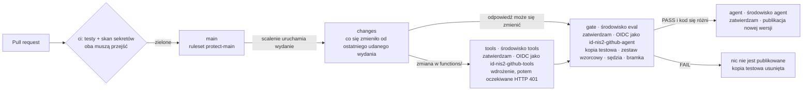

# Git, CI/CD i pipeline wydania

[English](pipeline.md) · **Polski**

Jak zmiana trafia z mojego Maca do Azure: tak to zaprojektowałem i zbudowałem w modułach H1 i H11. Obecny stan jest na [końcu](#stan-obecny). Cztery pliki pipeline'u są w [`pipeline/`](../pipeline/), skopiowane bez zmian z commita `892f75a`. W moim laboratorium leżą w `.github/` i `.githooks/`; tutaj są poza `.github/`, więc GitHub nigdy ich nie uruchamia.

**Spis treści**

1. [Jak wprowadzam zmianę](#jak-wprowadzam-zmianę)
2. [Sprawdzenia przed scaleniem](#sprawdzenia-przed-scaleniem)
3. [Wydanie](#wydanie)
4. [Ustawienia bez kluczy](#ustawienia-bez-kluczy)
5. [Łańcuch dostaw](#łańcuch-dostaw)
6. [Testy, które sprawdzają pipeline](#testy-które-sprawdzają-pipeline)
7. [Stan obecny](#stan-obecny)

## Jak wprowadzam zmianę

- Każda zmiana trafiła do `main` przez pull request z własnej gałęzi: od #1 do #10, po jednym na moduł od H2 do H11 (pierwszy niósł też pracę z H1).
- Commity używają adresu no-reply GitHuba, więc mojego adresu e-mail nie ma w historii.
- Na moim Macu hook commita ([pipeline/pre-commit](../pipeline/pre-commit)) odrzuca pliki z ustawieniami lub kluczami (`.env`, `local.settings.json`, `.pem`, `.pfx`, `.key`) i skanuje przygotowane zmiany gitleaksem. Jeśli gitleaksa brakuje, commit jest blokowany: hook w razie problemu blokuje, a nie przepuszcza (fail closed).


*Zamknięte pull requesty w repozytorium mojego laboratorium, 8 października 2026: po jednym na moduł, każdy scalony, z zaliczonymi sprawdzeniami (jedno sprawdzenie w #1–#9, dwa w #10).*

## Sprawdzenia przed scaleniem

[pipeline/ci.yml](../pipeline/ci.yml) uruchamia dwa zadania przy każdym pull requeście i każdej zmianie w `main`:

- **tests:** instaluje przypięte pakiety, sprawdza, czy szablon ustawień nie zawiera prawdziwych wartości, sprawdza zestaw wzorcowy względem klucza odpowiedzi i uruchamia testy, w tym ewaluację offline.
- **secrets:** skanuje gitleaksem 8.30.1 każdy commit w historii. Pobrany plik jest sprawdzany z sumą kontrolną opublikowaną przez gitleaks, więc podmieniony plik zatrzymuje zadanie.

Token workflow może tylko czytać, a nowszy push do tego samego pull requestu anuluje starszy przebieg.

Ruleset `protect-main` sprawia, że `main` przyjmuje zmiany tylko przez pull request, którego oba sprawdzenia przeszły na gałęzi aktualnej względem `main`. Force push i usunięcie `main` są zablokowane, a lista wyjątków (bypass) jest pusta.


*Sprawdzenia pull requestu #10 (H11), 8 października 2026: `tests` i `secrets` zaliczone.*

## Wydanie

[pipeline/release.yml](../pipeline/release.yml) uruchamia się po scaleniu z `main`:



1. **changes** ustala, co się zmieniło od ostatniego udanego wydania. Przebieg dla starszego commita kończy się tutaj, zanim o cokolwiek mnie poprosi.
2. **tools** uruchamia się tylko wtedy, gdy zmieniło się `functions/`. Loguje się jako `id-nis2-github-tools`, wdraża aplikację funkcji ze zdalnym buildem, a potem sprawdza, czy narzędzia nadal odpowiadają 401 na wywołanie bez tokena. To zadanie nie instaluje pakietów Pythona: uruchamia checkout GitHuba, dwie akcje Microsoftu, dwa moje skrypty w Pythonie i kilka linii shella.
3. **gate** loguje się jako `id-nis2-github-agent`. Buduje z tego commita testową kopię agenta, `kwestionariusz-nis2-next`, uruchamia na niej zestaw wzorcowy, daje sędziemu do oceny polskie sformułowania i pyta bramkę. Wyniki trafiają na stronę podsumowania przebiegu, a kopia testowa jest zawsze usuwana na końcu.
4. **agent** publikuje nową wersję `kwestionariusz-nis2` tylko wtedy, gdy bramka zwróciła PASS, kod różni się od działającego agenta, a przebieg jest na `main`.

Każde zadanie, które dotyka Azure, należy do środowiska GitHuba (`tools`, `eval` albo `agent`), ustawionego tak, żeby czekało na moje zatwierdzenie i uruchamiało się tylko z `main`. Każde zadanie loguje się przez OIDC: każde z trzech poświadczeń federacyjnych w Azure wskazuje jedno środowisko mojego repozytorium, więc zadanie spoza tego środowiska nie może się nim zalogować. Wydania uruchamiają się po jednym.

Dwie tożsamości są rozdzielone według ryzyka. Zadanie `gate` instaluje dziesiątki pakietów Pythona, więc zatruty pakiet mógłby działać z uprawnieniami tego zadania. Jego tożsamość nie może wdrożyć aplikacji funkcji, choć mogłaby utworzyć nową wersję agenta. Zadanie, które może wdrażać, prawie niczego nie uruchamia ([azure.pl.md](azure.pl.md#co-może-zrobić-skradziona-tożsamość)).

Publikacja odmawia działania poza GitHub Actions, więc nie mogę przez pomyłkę opublikować agenta z mojego Maca. To zabezpieczenie przed pomyłkami, a nie granica bezpieczeństwa. `agents/release.py`, linie 56–59:

```python
    if args.create and os.environ.get("GITHUB_ACTIONS") != "true":
        print("STOP: --create runs only in the release workflow, after the golden set and the gate. "
              "Merge your change into main and approve the release instead. Nothing was published.")
        return 1
```

Każda opublikowana wersja zapisuje commit, z którego ją zbudowano. `agents/release.py`, linia 40:

```python
        description=f"Published by the release workflow from commit {commit}, after the golden-set gate said PASS.",
```

## Ustawienia bez kluczy

GitHub nie przechowuje żadnego klucza ani hasła do Azure. Ustawienia zadań (nazwy, identyfikatory i adresy) są w jednym sekrecie środowiska, `DOTENV`, który dostaje tylko zadanie zatwierdzone w swoim środowisku. Zanim cokolwiek mogłoby je wypisać, każda wartość, która mogłaby zidentyfikować mój tenant lub zasoby, jest maskowana w logach. `tools/ci_env.py`, linie 83–84:

```python
    for value in hidden:   # first, before anything can print a value
        print(f"::add-mask::{value}")
```

Ustawienia Actions w repozytorium dodają własne zasady, które obowiązują nawet wtedy, gdy plik workflow o czymś zapomni:

- Mogą działać tylko akcje GitHuba, moje własne oraz `azure/login` i `Azure/functions-action` Microsoftu.
- Workflow z forka zewnętrznego współtwórcy czeka, aż go zatwierdzę.
- Token workflow może tylko czytać i nie może zatwierdzać pull requestów.

## Łańcuch dostaw

- Każdy pakiet Pythona jest przypięty do dokładnej wersji w `requirements.txt`.
- Każda akcja jest przypięta do pełnego ID jednego commita, z wersją obok.
- Dependabot ([pipeline/dependabot.yml](../pipeline/dependabot.yml)) co tydzień proponuje aktualizacje pakietów i akcji, tylko do wersji, które mają co najmniej 7 dni, i grupuje drobne zmiany. Aktualizacje bezpieczeństwa przychodzą od razu. Każda aktualizacja przechodzi te same sprawdzenia i nic nie jest scalane automatycznie.
- Alerty Dependabot włączyłem w H1, a aktualizacje bezpieczeństwa Dependabot w H11.

## Testy, które sprawdzają pipeline

[code/tests/test_workflows.py](../code/tests/test_workflows.py) zawiera 26 testów, które czytają pliki workflow i blokują pull request, który łamie zasadę. Między innymi:

- każda akcja jest przypięta do pełnego ID commita i używane są tylko cztery zaufane akcje;
- do Azure mogą się logować tylko zadania przypisane do środowiska, a każde zapisuje tylko ustawienia własnego środowiska;
- jedynym sekretem jest `DOTENV`, i to tylko w zadaniach wydania;
- żaden wyzwalacz nie uruchamia cudzego kodu z moimi uprawnieniami (`pull_request_target`, `workflow_run`);
- żadnego wyrażenia `${{ }}` w skrypcie, więc spreparowana wartość nie może stać się poleceniem;
- checkout nigdy nie zostawia tokena, a nic nie trafia tam, skąd mógłby to pobrać dowolny użytkownik GitHuba;
- zadanie wdrażające nie uruchamia pakietów Pythona i kończy się sprawdzeniem 401;
- zadanie gate nigdy nie publikuje, zawsze usuwa swoją kopię testową i nic nie może przemilczeć nieudanej bramki;
- publikować może tylko zaliczona bramka na `main`;
- każde zadanie ma limit czasu.

## Stan obecny

Moje repozytorium laboratorium jest prywatne. Na GitHub Free prywatne repozytorium nie dostaje reguł ochrony środowisk ani sekretów środowisk, a rulesety nie są egzekwowane (dokumentacja GitHuba, sprawdzone 8 października 2026). Dlatego nowe wydanie nie zadziałałoby tam tak, jak je zaprojektowałem:

- jego zadania nie czekałyby na moje zatwierdzenie;
- nie dostałyby swoich ustawień, a `tools/ci_env.py` zatrzymuje zadanie bez ustawień, zanim zaloguje się ono do Azure;
- CI i mój hook commita nadal działają.

Pliki w tym repozytorium pokazują, jak to zaprojektowałem.

Jedyny dotychczasowy przebieg wydania zaczął się od scalenia pull requestu #10. 8 października 2026 nadal czekał przy zadaniu `tools` na mój przegląd, więc niczego nie wdrożył, a bramka się nie uruchomiła.


*Ten przebieg 8 października 2026: `changes` zaliczone; `tools` czeka na mój przegląd, zanim będzie mogło wdrażać; `gate` i `agent` się nie zaczęły.*
